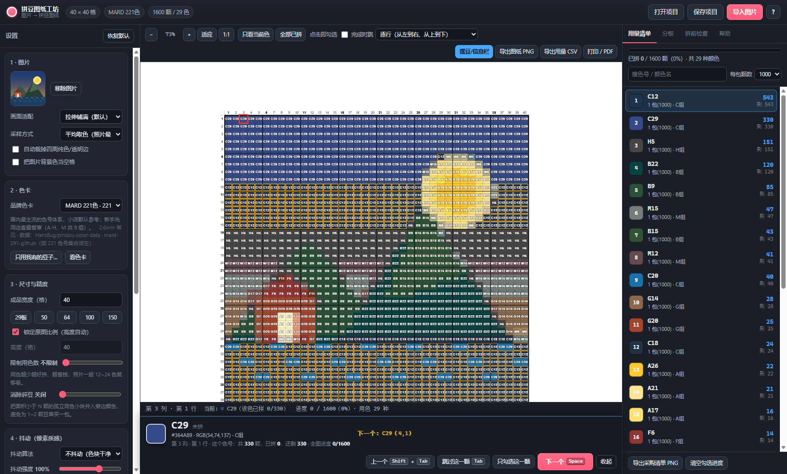
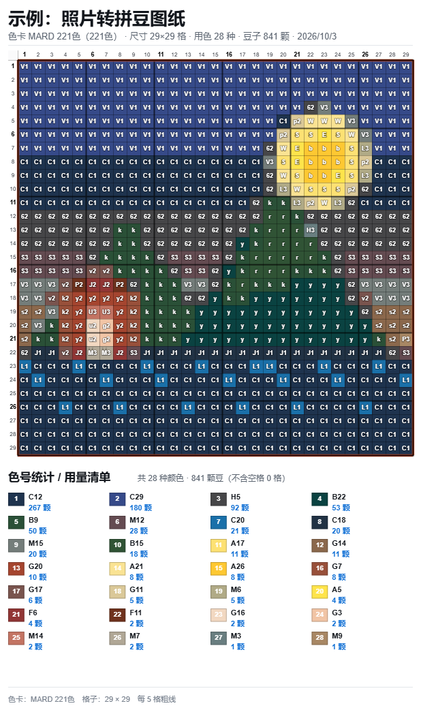
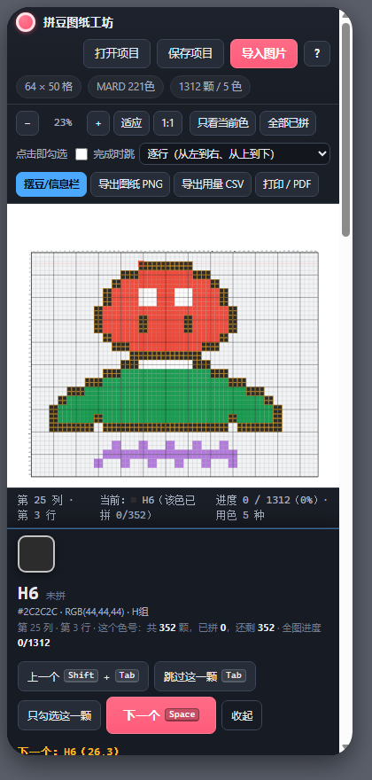

# 拼豆图纸工坊 · Pindou Pattern Studio

把一张图片转成**能照着拼的拼豆图纸**：带网格坐标、每格色号、用量统计，并且能一边拼一边勾进度。

纯本地运行（HTML + 原生 JS，零依赖、不联网、不上传图片），Windows 上双击 `index.html` 就能用；
代码按「核心逻辑 / 界面 / 导出」分层，方便后期直接搬到 Android（见第 8 节「Android 移植」）。







---

## 1. 快速开始

**方式 A（最省事）**：直接双击 `pindou-app\index.html`。（已专门适配 `file://`：
导入图片走「文件 → data/Blob URL → 像素」的链路，不会触发浏览器对本地文件的 canvas 污染限制。）

**方式 B（推荐，功能最全）**：本地起个小服务再打开
```powershell
node tools/serve.js          # 然后浏览器打开 http://127.0.0.1:8765/
```
> 两种方式功能都完整。差别只在：个别浏览器在 `file://` 下会禁用 localStorage，
> 那样就用不了「自动恢复上次进度」（会有提示，不影响其它功能）。

第一次用没有图片？点中间的 **「试个示例图案」** 立刻看到完整效果。

---

## 2. 核心功能

### 2.1 图片 → 图纸
- 导入：点击 / 拖拽 / **Ctrl+V 直接粘贴截图**；支持 JPG / PNG / WebP / GIF（第一帧）
- 自动裁掉四周纯色或透明边框、把背景色当空格（透明 PNG 自动留白）
- **采样方式**三种：平均取色（照片最佳）、主色取色（保留纯色块）、最近点（像素画/表情包）
- **画面适配**三种：拉伸铺满 / 裁掉多余 / 完整放入（留白）
- 分辨率 = 成品格数，1~400 格自由设定，可锁定原图比例；一键预设 29（一块标准板）/ 50 / 64 / 100 / 150
- **限制用色数**：先聚类再吸附到真实色号，用色越少越好拼、越省钱（照片 12~24 色通常就够看）
- **消除碎豆**：把面积小于 N 颗的孤立同色小块并入旁边颜色，避免为 1~2 颗豆单买一包
- **抖动**：Atkinson / Floyd–Steinberg / Sierra / 有序抖动，强度可调（默认关闭，色块更干净）
- 镜像翻转（烫完才是正的）、90° 旋转

### 2.2 色卡（9 套，共 2287 个颜色）
| 色卡 | 品牌 | 色数 | 说明 |
|---|---|---|---|
| MARD 221色 | MARD | 221 | **国内最主流**，小店默认参考，新手建议先用这套 |
| MARD 291色 | MARD | 291 | 221 的扩展全色版，色域更全 |
| COCO 291色 | COCO / 可可 | 291 | 性价比高、线下店常见 |
| 漫漫家 278色 | 漫漫家 | 278 | 老牌，早期图纸生态常见 |
| 盼盼家 289色 | 盼盼家 | 289 | 工具站 / 材料包常见 |
| 咪小窝 290色 | 咪小窝 | 290 | 玩家圈常见（含 4 个原始资料无法确认的色号，标为 UNKNOWN） |
| 优肯 / Artkal 418色 | Artkal | 418 | 官方体系：C 系列 197 + M 系列 221（含透明材质 CT/MH） |
| Perler 117色 | Perler（美） | 117 | 5mm 国际主流 |
| Hama 92色 | Hama（丹） | 92 | 5mm 国际老牌 |

- 匹配在 **CIELAB 空间 + CIEDE2000** 距离下做，比直接比 RGB 更接近人眼判断
- 「只看我有的豆子」：粘贴你手上的色号，转换时只用这些颜色（自动保存）
- 「看色卡」：整张色卡一览，点任意颜色即可定位到图上该颜色的位置

### 2.3 对比图 / 图纸（导出的 PNG 长这样）
- 每个格子里写着**对应色号**（可切成「序号」或「符号」模式）
- **网格**可开关，**每 5 格一条粗线**（间隔可调 0~20）
- **行列坐标**标注在顶部与左侧，粗线处的坐标自动加粗；坐标间隔可调（如每 5 格只标一个数字）
- **正下方是完整统计表**：色块 + 序号 + 色号 + 颗数（可切换网格内标注为序号，与统计表一一对应）
- 可选**分板粗线**（默认 29×29），一眼看出哪几列属于哪块板
- 格内标注三种模式：色号（MARD A1 / COCO A01）、序号（格子更干净）、符号（黑白打印 / 色弱友好）

### 2.4 拼的时候怎么用（这是重点）

**点选查看信息，按「下一个」才推进**：
1. **左键点任意格子** → 只是选中，底部信息栏立刻显示这一格的详细信息：
   色号、颜色名、HEX、RGB、所属色组、**这个色号共多少颗 / 已拼 / 还剩**、整图进度，以及**下一个会是谁**。
   点着看不会改变任何进度，可以放心来回点。
2. 确认手上拿的豆子对了，按 **「下一个」**（或 <kbd>Space</kbd> / <kbd>Enter</kbd>）：
   把当前这颗**勾选**为已拼，然后**跳到下一个未拼的格子并显示它的信息**。
3. 另外三个按钮：
   - **跳过这一颗**（<kbd>Tab</kbd>）：不勾选，直接看下一个未拼的格子
   - **只勾选这一颗**：勾上但**不移动**，适合边看边核对
   - **上一个**（<kbd>Shift</kbd>+<kbd>Tab</kbd>）：往回走，并把当前这颗取消勾选，方便退回去重拼

工具栏上的 **「摆豆/信息栏」** 按钮用来显示/收起这条底部信息栏（它停在画布下方，不会挡住图纸）。

- 前进顺序可选：逐行 / 逐列 / 蛇形 / **按色号**（一种颜色拼完再换下一种）
- 想回到「点一下就算拼好」的老手感：打开工具栏的 **「点击即勾选」**，或临时按住 <kbd>Alt</kbd> 点格子
- 点住拖动 = 连续勾选一片（批量补进度）；<kbd>Ctrl</kbd>+拖拽 = 框选批量勾选
- **右键格子 / 右键统计行**：把这个色号全部标为已拼、清空该色号进度、只看这个色号、换色号…
- **只看当前色**：其他颜色压暗，只高亮一种色号（按 <kbd>I</kbd> 开关，或点统计行 / 按 <kbd>1</kbd>~<kbd>9</kbd>）
- 已拼格子自动变淡打勾，进度条 + 按色号进度实时更新；<kbd>Ctrl</kbd>+<kbd>Z</kbd> 撤销
- **分板**面板：按拼豆板尺寸切分，逐块显示「还差几颗」，点一下跳到该板未完成处
- **拼前检查**：自动提示易混色（ΔE 定量）、用量 ≤3 颗的颜色、用色数是否过多、空格比例、是否需要镜像、需要几块板

### 2.5 导出
- **图纸 PNG**：上面那张完整对比图（网格 + 坐标 + 色号 + 统计表 + 进度）
- **采购清单 PNG**：色号 / 颗数 / 需要几包（500 / 1000 / 2000 每包可切换）
- **用量 CSV**：色号、名称、分组、HEX、RGB、颗数、包数、已拼、剩余
- **逐颗坐标 CSV**：每颗豆的列、行、色号（方便核对或二次开发）
- **打印 / PDF**：第 1 页总图 + 用量表，之后每页最多 4 块分板图（带整图真实行列号）
- **项目文件 `.pindou.json`**：包含进度，可分享给别人继续拼；内嵌色卡，换台电脑也不会跑色
- 自动保存到浏览器本地，误关页面后重新打开会恢复上次的图纸和进度

---

## 3. 快捷键

| 按键 | 作用 |
|---|---|
| 方向键 | 移动选中格（**只看信息，不勾选**） |
| `Space` / `Enter` | =「下一个」：勾选当前这颗，跳到下一个未拼的格子 |
| `Tab` / `Shift+Tab` | =「跳过这一颗」/ 上一个（不勾选） |
| `Del` / `Backspace` | 取消当前这颗的勾选（不移动） |
| `Alt`+点击 | 临时按「点击即勾选」处理这一下 |
| `1`…`9` | 切到用量第 N 名的颜色（=只看该色） |
| `0` | 取消只看当前色 |
| `I` | 只看当前色开关 |
| `B` | 显示/收起底部信息栏 |
| `+` / `-` | 放大 / 缩小 |
| `Ctrl+Z` | 撤销 |
| `Ctrl+S` | 保存项目 |
| `Ctrl+O` | 打开项目 |
| `Ctrl+V` | 粘贴图片或项目 JSON |
| `Ctrl+P` | 打印图纸 |
| `F1` | 帮助 |

鼠标：左键点=选中看信息，拖动=连续勾选，右键=菜单，滚轮=缩放，空格或中键拖动=平移，`Ctrl`+拖拽=框选。

---

## 4. 目录结构

```
pindou-app/
├── index.html                 # 单页应用（普通 <script>，file:// 直接打开也能跑）
├── manifest.webmanifest       # PWA 清单（Android 可"添加到主屏幕"）
├── styles/app.css
├── src/
│   ├── core/                  # ★ 纯逻辑，无 DOM 依赖，可被 Android 直接复用
│   │   ├── color.js           # sRGB/Lab 转换、CIEDE2000、Lab 空间 k-d tree
│   │   ├── palette.js         # 色卡模型 + 最近色匹配（5bit 反查表 + 精确缓存）
│   │   ├── sampler.js         # 图片降采样（平均/主色/最近点）、裁剪、自动去边
│   │   ├── quantizer.js       # 量化：抖动（FS/Atkinson/Sierra/Bayer）、限色、碎豆合并
│   │   ├── pattern.js         # 图纸模型：统计、进度、导航、分板、序列化、采购清单
│   │   └── render.js          # 绘制：画布视图 + 图纸导出（网格/坐标/色号/统计表）
│   ├── data/palettes.js       # 自动生成：9 套色卡（由 _upstream/data/*.csv 编译）
│   ├── ui/
│   │   ├── ui.js              # 视图状态、鼠标/键盘交互、统计面板、色卡一览
│   │   └── exporters.js       # PNG / CSV / 打印页 生成
│   └── app.js                 # 状态与编排：转换流水线、导入导出、摆豆模式、项目存取
├── tools/
│   ├── build-palettes.js      # CSV -> src/data/palettes.js
│   ├── serve.js               # 零依赖静态服务器（默认监听所有网卡，手机可访问）
│   ├── test-core.js           # 核心逻辑测试（86 项）
│   ├── test-static.js         # 静态检查 + 沙箱加载（28 项）
│   ├── test-mobile.js         # 手机/窄屏测试（72 项，320/360/390/820px）
│   ├── make-test-image.py     # 生成测试素材
│   ├── build-selftest-asset.js# 把示例图内联成 data URL（供 file:// 自检）
│   └── run-selftest.ps1       # 无头浏览器界面自检
└── tests/
    ├── selftest.html          # 界面自检页（iframe 方式）
    ├── selftest-asset.js      # 自动生成：内联示例图
    ├── sheet-preview.html     # 导出图纸预览
    ├── mobile-host.html       # 手机测量宿主页（供 test-mobile.js 用）
    └── phone-shot.html        # 手机宽度截图页
```

### 打包给别人用
整个 `pindou-app` 目录就是全部内容（约 1 MB），拷走即可离线运行，不需要 Node、不需要联网。
（`tools/`、`tests/` 是开发与测试用的，删掉也不影响使用；要重新编译色卡才需要 Node。）

---

## 5. 在手机上使用

应用本身是纯静态网页，**手机上能直接用**。已按 320 / 360 / 390 / 820px 宽度实测：
无横向溢出、触屏点选与「下一个」按钮都能正常操作，并且手机上会自动把图纸放到最上面、底部信息栏常显。

### 方式 A：电脑当服务器，手机连同一个 WiFi（推荐，代码一个字都不用改）
```powershell
node tools/serve.js          # 会打印出「手机打开」用的局域网地址
```
启动后终端会列出类似 `http://192.168.31.8:8765/` 的地址，手机浏览器打开即可。
- 手机和电脑必须在同一个 WiFi；Windows 首次会弹防火墙提示，**选「允许访问」**。
- 图片处理全在手机浏览器里跑，电脑只负责发文件；电脑关机后手机就打不开了。
- 想固定端口：`node tools/serve.js 8765`；只想本机访问：`node tools/serve.js 8765 127.0.0.1`。

### 方式 B：把文件夹拷进手机（不用电脑，但受浏览器限制）
用数据线/OTG U 盘把 `pindou-app` 整个目录拷进手机存储，再用手机浏览器打开里面的 `index.html`。
- **Android**：Chrome/Edge 打开 `file://` 页面一般可以导入图片并导出；
  个别机型/浏览器会限制本地文件读取，那就改用方式 A。
- **iOS**：Safari 对 `file://` 限制较多，建议用方式 A。

### 方式 C：装成 App / 加到主屏幕
- 现在已经配好 `manifest.webmanifest`（`display: standalone`）。
  用方式 A 的地址打开后，Android Chrome 菜单里「添加到主屏幕」，用起来就和 App 差不多。
- 真正打包成 APK 见第 7 节「Android 移植」——推荐 WebView 套壳，需要改的接入点都列好了。

### 手机端已经处理好的细节
| 项目 | 说明 |
|---|---|
| 导入图片 | `<input type="file" accept="image/*">`，Android 上会直接弹「相册 / 相机」 |
| 布局 | ≤940px 自动改纵向：**图纸在最上面**，设置往下翻；顶栏与工具栏自动换行 |
| 底部信息栏 | 触摸设备上**默认展开**（手机没有鼠标悬停），按钮加大到约 42px 高，方便手指点 |
| 缩放平移 | 单指拖动平移、双指捏合缩放、点按选中格子（滚轮缩放保留给电脑） |
| 导出 | 手机支持系统分享时走**系统分享面板**（可直接「存到相册」或发微信），否则退回普通下载 |
| 进度保存 | 默认存浏览器本地，关掉浏览器再打开会恢复上次图纸与进度（清缓存会清掉） |

### 已知限制（手机上）
- 「空格/中键拖动平移」这类鼠标操作在手机上不存在，改用单指拖动。
- 超大图（如 200×200）在小屏手机上导出 PNG 会占较多内存，建议先调小「单格像素」。
- iOS Safari 用 `file://` 打开时分享/下载行为不一致，建议走方式 A。

---

## 6. 开发 / 测试

```powershell
node tools/build-palettes.js     # 重新编译色卡（改了 _upstream/data/*.csv 之后）
node tools/build-selftest-asset.js  # 换了示例图之后重新内联
node tools/test-core.js          # 核心逻辑测试（色彩科学、采样、量化、图纸、序列化、压缩）
node tools/test-static.js        # 语法 / 依赖顺序 / DOM id / 模块接口 / 沙箱集成
node tools/serve.js              # 本地预览 http://127.0.0.1:8765/
```

**浏览器内自检**（不需要人点，直接看结果）：
- 打开 `http://127.0.0.1:8765/index.html?selftest=1&cols=64&palette=coco-291`
  页面跑完会在 `<pre id="selftestResult">` 输出 42 项界面级检查结果。
- 加 `&sheets=1` 会把导出的图纸 PNG 直接贴到页面上（并可自动下载），用来肉眼检查排版。
- 无头跑一遍：`powershell -File tools/run-selftest.ps1`

**手机/窄屏测试**（需要先起 serve.js）：
```powershell
node tools/test-mobile.js        # 320/360/390/820px 四种宽度，72 项检查
```
> 说明：headless 窗口有最小宽度（本机实测 504px），`--window-size=390` 到不了 390；
> CDP 的 `setDeviceMetricsOverride` 在 headless 下也不会缩小布局视口。
> 所以这个脚本改用「把应用加载进指定宽度的 iframe」来得到真实的手机 CSS 宽度，
> 并用真实 Touch 事件驱动点选，再用 DevTools 协议从外部读回测量结果。

当前测试状态：
- 核心逻辑 **86 项**（含 CIEDE2000 与 Sharma 标准数据集逐条比对、最近色全局最优性、
  contain/cover 几何、抖动亮度守恒、白名单/限色、孤立块合并、进度与序列化往返、压缩率）
- 静态检查 **28 项**（语法、脚本依赖顺序、DOM id 引用、模块接口、沙箱加载执行）
- 浏览器界面 **42 项**（真实渲染、点选查看信息 +「下一个」推进、跳过/只勾选/上一个、撤销、
  只看当前色、图纸/清单 PNG、CSV、项目往返、打印分页、分板绘制、信息栏、显示选项切换、色卡一览）
- 手机/窄屏 **72 项**（320/360/390/820px：无横向溢出、图纸置顶、信息栏常显、
  「下一个」触摸目标 ≥32px 且在可视区、真实 Touch 事件点选 → 勾选 → 推进）
- 桌面界面在 **`http://` 与 `file://` 两种打开方式下都验证通过**。

---

## 7. 色号数据来源与免责说明

- 国产色卡（MARD / COCO / 漫漫 / 盼盼 / 咪小窝 / 优肯）来自社区公开整理的数据仓库
  [HansBug/pindou-color-data](https://github.com/HansBug/pindou-color-data)，
  该仓库对每个色号的来源、分组、缺失码都有交叉核对记录；本项目只做转写与校验，不改数值。
  - MARD 221 是从 291 色表里按 221 的色号集合（A–H、M 共 9 组，221 个）**派生**的，
    避免重复抄写引入误差（`tools/build-palettes.js` 里有断言：派生结果必须正好 221 色）。
  - 原始 CSV 保留在 `_upstream/data/`，可逐行追溯；重新生成只需跑 `build-palettes.js`。
- Perler / Hama 的色值为社区从实物照片采样，`stitchmate.app` 的色表与
  [maxcleme/beadcolors](https://github.com/maxcleme/beadcolors) 的色号集合完全一致（色值略有差异）。
- ⚠️ **屏幕颜色 ≠ 实物豆子颜色**。不同批次、不同显示器都会有偏差；
  正式作品请对着实物色卡确认，本工具的色号只保证"按公开色卡数据算出来是哪个色号"。
  「拼前检查」里的易混色提示（ΔE）就是专门用来提前发现这类风险的。

---

## 8. Android 移植说明（这是你后期要做的事）

设计时已经为移植做了准备：

1. **核心逻辑与平台无关**：`src/core/*.js` 是纯函数（不碰 DOM），
   只依赖 `PindouColor / PindouPalette / PindouSampler / PindouQuantizer / PindouPattern / PindouRender`。
   `render.js` 只依赖 Canvas 2D 接口（Android 上可用同签名的适配层替换）。
2. **推荐路径：WebView / Trusted Web Activity 套壳**（改动最小）
   - 把 `pindou-app/` 整个目录放进 `app/src/main/assets/`，用 WebView 加载 `file:///android_asset/index.html`
   - 需要实现/配置的点：
     - 图片选择：`<input type="file">` 在 WebView 里需要 `WebChromeClient.onShowFileChooser` 转发到系统相册
     - 保存文件：`PindouExport.saveCanvas(canvas, name)` 已经是统一出口
       （支持系统分享时走分享面板，否则走下载）。套壳时把 `downloadBlob` 换成
       调用 `AndroidBridge.saveFile(name, base64)`，由原生写进 `MediaStore` 或 `ACTION_CREATE_DOCUMENT` 即可。
     - 分享：把导出的 PNG 交给 `FileProvider` + `ACTION_SEND`
     - 持久化：`localStorage` 在 WebView 里可用，但更稳妥的是让原生侧存项目 JSON
     - 关闭 WebView 的 `setBlockNetworkLoads(true)` 保证完全离线；开启 `setDomStorageEnabled(true)`
   - 布局/交互已经按手机调好（图纸置顶、信息栏常显、按钮加大、单指平移双指缩放），套壳后基本不用改界面。
   - 也可以先做成 PWA（`manifest.webmanifest` 已配好）加到主屏幕用着。
3. **若要走原生（Kotlin）**：`core/` 六个文件是很好的移植清单——
   `color.js`（色彩数学）、`quantizer.js`（抖动/量化）、`pattern.js`（数据模型与压缩）
   可以逐函数翻译；色卡数据 `palettes.js` 直接转成 JSON 资源。
4. **移植时注意**：
   - 大图转换在主线程会卡，Android 上把 `quantizeAsync` 的分片逻辑换成协程/后台线程
   - `Uint8ClampedArray` 图片数据 → Android 用 `Bitmap.getPixels()` 的 `IntArray`，
     在 `sampler.js` 里加一个输入适配层即可（采样函数只用到 `data/width/height`）
   - 触屏交互已经在 `ui.js` 里做了（单指平移、双指缩放、点按选中），可直接复用
   - 手机上的行为已用 `tools/test-mobile.js` 固化（72 项），改完跑一遍就知道有没有破坏手机端

---

## 9. 已知限制

- 格内色号在导出时会受单格像素限制：单格太小（< 9px）时自动只画颜色不画字，想看清色号请调大「单格像素」。
- 图纸导出画布上限约 16384×16384 像素（浏览器限制），超了会提示调小单格像素。
- 用色数很多（>150）时长图的统计表会很长，此时建议先「限制用色数」再导出。
- 大图（如 200×200）按色号顺序导航会有几毫秒的排序开销，已做缓存，不影响使用。
- `file://` 下所有功能都可用，但自动恢复上次进度依赖 localStorage，部分浏览器在该协议下会禁用（会给出提示）。
